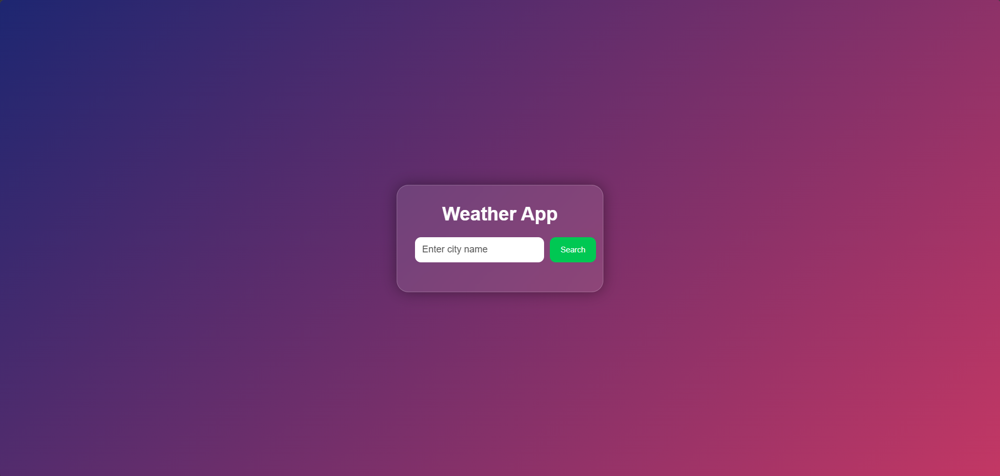
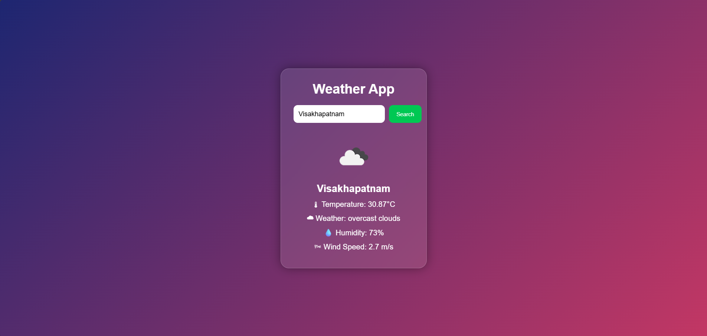

# Weather App using API

## Task
Frontend Development Internship – Alfido Tech

---

## Objective
The objective of this project is to develop a responsive weather application using HTML, CSS, and JavaScript that fetches real-time weather data using API integration.

---

## Tools & Technologies Used
- HTML5
- CSS3
- JavaScript
- OpenWeatherMap API
- GitHub
- GitHub Pages
- VS Code

---

## Project Description
This project is a responsive Weather App developed using HTML, CSS, and JavaScript.

The application uses the OpenWeatherMap API to fetch and display real-time weather information for different cities.

It includes features like weather icons, temperature display, humidity, wind speed, keyboard support, and error handling with a modern user interface.

---

## Features
- Search weather by city name
- Real-time weather data
- Temperature display
- Humidity and wind speed
- Weather icons
- Keyboard support
- Error handling
- Responsive modern UI

---

## Project Files
- index.html
- style.css
- script.js

---

## Screenshots

### Weather Search Interface

### Weather Result Example

---

## Live Website
https://sathvika2007.github.io/weather-web-app/

---

## GitHub Repository
https://github.com/sathvika2007/weather-web-app

---

## Conclusion
This project helped me improve my frontend development skills and gain practical experience in API integration and responsive web application development using JavaScript.
